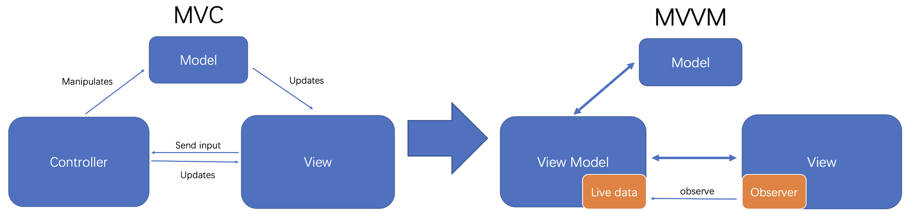
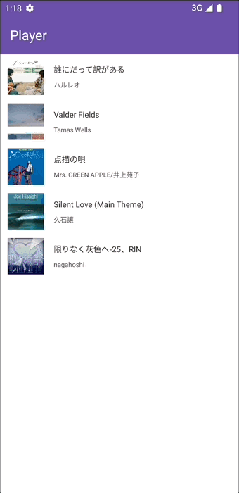

# KotlinAudioPlayer

## What is KotlinAudioPlayer

At the beginning, I just want to write a simple Android music player with basic function with Material Design. It has been finished and it may add some new features in the future. Also, I would like to thank Professor Subrota for his help in the development process.

## Architecture

Here I choose to use MVVM instead of MVC, for easier to reuse the components, and better to decoupled the Business Logic from User Interface.

## Features

-   Basic Player Function (Play, pause, skip to next and previous)
-   Different Play Modes (Shuffle, repeat and repeat one mode)
-   Playlist with Album Cover, Song and Artist
-   Bottom Bar with play state and play/pause button
-   Material Design

## How to use

### Requirement

-   SDK: 30 or higher (32 is recommended)
-   Gradle: 7.1.1

You just need to make sure that your audio files are placed in your local media library (Files -> Audio), then the player will load the media metadata automatically. Enjoy your music.

## Screenshots

-   **Playlist and Now Playing interface**

    

-   **Animation Sample (With Cursor)**

    